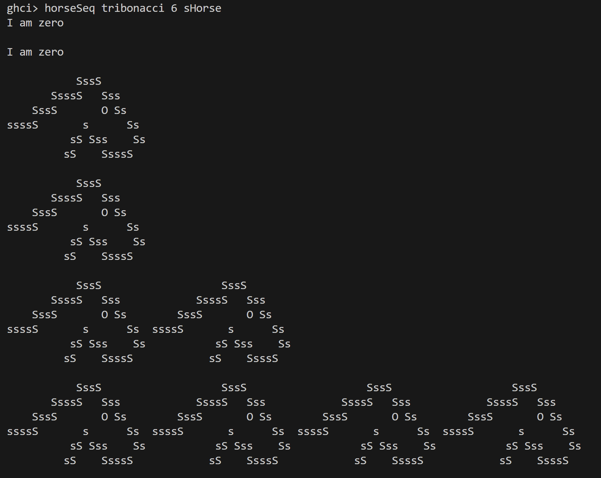
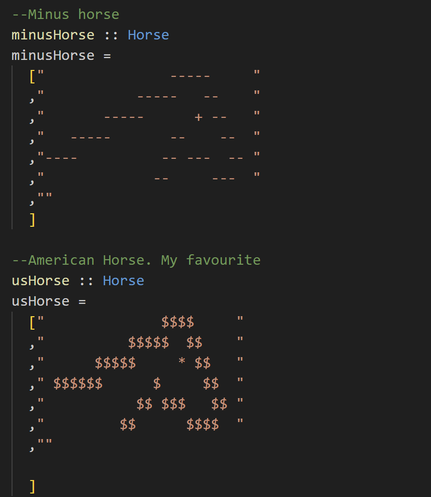

# Haskell Coursework: Horse, Developed by Zhouzhou Zhang

This is a haskell program displaying some ascii horses

# Compile and Run

Simply open the GHCI

    $ ghci

Load the file

    :l cwk2_24-25

Run the function

    ghci> horseSeq $ tribonacci 7 $ horse

Also, modify the main function, compile the file and run it

    $ ghc --make cwk2_24-25.hs
    $ ./cwk2_24-25

# Horses

Horse is a type alias that is a list of string.

    type Horse = [String]

There are many styles of horse in this work, pick up what you like

# Print Horse

To print one horse, simply apply putStrLn to every single string inside the horse

    mapM_ putStrLn oHorse

To print multiple horses in one line, using zipWith and (++)

    horses :: Int -> Horse -> Horse
    horses 0 _ = noHorse
    horses n h = zipWith (++) h $ horses (n-1) h

To print horses according to a sequence, use mapM_ again and lambda expression.

    psuedocode
    mapM_ (\n -> print n horses)

# Rotate Horse

Several functions used to rotate the horse. transpose rotates the horse to right 90 degree

    transpose = transpose' . reverse

transpose180 simply calls transpose twice

    transpose180 = transpose . transpose

mirror flips the horse

    mirror = map reverse

transpose270 reverses the horse and mirrors them

    transpose270 = mirror . reverse

# Sequence

A tribonacci sequence generator is implemented

    tribonacci n = take n tribo

Along with the lazyCaterer sequence

    lazyCaterer n = take n lazyCaterers

# Monad

I don't know why it is called Monad (So far as I know it is a library related with IO). Two safe functions are implementeed using Maybe.

    //psuedocode
    shead nothing -> return nothing
    shead something -> return someting

    stail nothing -> return nothing
    stail something -> return something